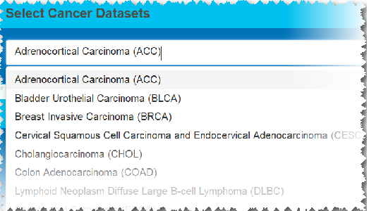
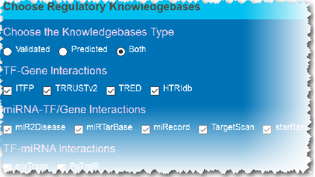
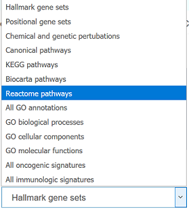

---------------------------------------------------------------------

This is a brief introduction of the CMTCN.

CMTCN is a freely available web tool that provides a comprehensive and intensive analysis of combinatorial regulatory interactions between transcription factors, microRNAs, and target genes.For each type of cancer, CMTCN identifies four types of 3-nodes TF-miRNA co-regulatory motifs (three FFLs and one co-regulation motif) consisting of a TF, a miRNA and their co-targeted gene. CMTCN can construct and depict cancer-specific co-regulatory networks in various tumor types, and meanwhile, it uncovers miRNA and TF co-regulatory relationships. On top of all that, CMTCN screens out important nodes in the co-regulatory network based on network topology analysis and provides genes/TFs/miRNAs enrichment according to different annotated datasets
### I. Start: Job submission

CMTCN exhibits a neat and user-friendly layout. Users initiate their study by following three steps: 

#### (i) Choose a specific cancer

CMTCN is available to show the study about 33 cancers.

#### (ii) Select the knowledgebases to build the co-regulatory network

The key step for constructing the TF-miRNA co-regulatory network is the identification of relationships among TFs, miRNAs and their joint targets. CMTCN utilized information provided by established regulatory databases of both predicted and experimentally validated interactions which contain the information of the regulation of TF-Gene, TF-miRNA, and miRNA-gene/TF.Users are free to choose different regulatory databases to establish co-regulatory relationships.

#### (iii) Construction of the co-regulatory network

CMTCN supports full or partial network construction and analysis.One is to establish a complete co-regulatory network, and the other is to view the co-regulatory network for specific genes/miRNAs.

#### a. Full co-regulatory network

It will display the entire co-regulatory network of selected cancer.

#### b. Subgraph

CMTCN enables the users to investigate the subgraph of the co-regulatory network which relates to specific genes/miRNAs. CMTCN pre-computed a number of related gene/miRNA gene sets.

#### Top mutated genes

This data set involves top mutated genes for different types of cancer.

#### Clinical stage-related genes

Significant genes related to clinical stage were provided in individual cancers and can be directly used as queries to map them to co-regulatory networks and evaluate their impact.

#### Custom Input

CMTCN supports multiple gene queries. Users can query their interested genes/miRNAs. The limit of the query is 500.

  
  

#### Upload Local Data

Users can also upload a local .txt file for the query. The text file requires one gene/miRNA per line, and the sample file can be downloaded.

#### (iv) Click the submit button.

The input data can be checked and modified through the input box.
After the input data being checked, just press the "submit" button to
submit the job and start the co-regulatory network research!

### II. Analysis: The comprehensive analysis of cancer-specific co-regulatory network
#### (i) The control panels and the network refinement

There are four control panels to adjust the information about co-regulatory pairs and three types of FFLs.

a.Display and cutoff. Users can decide whether to check this type of co-regulation and whether to use TCGA expression data to refine the co-regulatory network.

b.Network refinement. CMTCN capitalizes on TCGA expression data to select important co-regulatory interactions. It calculates pairwise Spearman correlation values between TFs, miRNAs, and genes. Users can refine co-regulatory pairs or FFLs on the basis of correlation p-values and correlation coefficients.For instance, when the user sets the p-value cutoff to 0.05 and the correlation coefficient cutoff to 0.2, CMTCN displays a TF-target edge of p-value less than 0.05 with correlation coefficients whose absolute values are equal or greater than 0.2. Since most miRNAs are assumed to inhibit the expression of their targets, CMTCN shows miRNA-target edge p-value less than 0.05 and correlation coefficient less than or equal to -0.2. 

c.TF regulation differentiation. Users can indicate which types of TF-target regulation they need. CMTCN gives the user the ability to select to differentiate between positive and negative TF regulation. Thus, if the user needs to examine only positive or negative regulation, CMTCN can retain only positive or negative correlation coefficient interactions, respectively.

#### (ii) Network Visualization 

The TF-miRNA co-regulatory network is constructed by merging the three types feed forward loops and significant TF-miRNA pairs together.
CMTCN pools regulatory relationships including TF-gene, TF-miRNA, miRNA-gene, miRNA-TF. Based on the regulatory relationships above, the significant co-regulatory pairs and 3-node feed-forward loops are identified. There are three types of the 3-node feed-forward loops: TF-FFLs, miRNA-FFLs and composite-FFLs. In a TF-FFL, TF is the master regulator, which regulates its partner miRNA and their joint target, while in a miRNA-FFL, miRNA is the master regulator. Together, TF-FFL and miRNA-FFL can combine into a composite-FFL where miRNA and TF regulate each other.
CMTCN adopts D3.js which depicts an interactive and intuitionistic force-directed graph for the co-regulatory network.

Users can interactively modify the force-directed graph for better presentations by setting the link distance, node repulsion and the number of displayed co-regulatory relationships.

In the cancer-specific co-regulatory network, there are yellow nodes, red nodes and green nodes representing genes, TFs and miRNAs respectively.

It should be mentioned that the default interactions displayed for each type of co-regulatory are limited to 100 for a better response and presentation.CMTCN orders each type of co-regulatory interactions by the sum of the three-node degree and gives preference to higher sum-degree relationships for presentation. The node degree information is from the network topology analysis. Of course, users can decide how many interactions to display (perhaps all the relationships, even more than 100, if they don't affect viewing) and query the detailed and entire interactions information from the section "co-regulatory interactions".

What is more, CMTCN has four color schemes for the network visualization. If you are fascinated about the network, save it!

#### (iii) Network Topology

CMTCN provides detailed network topology infomation.
a.Network density. The proportion of present edges from all possible edges in the network.

b.Nodes degree and degree distribution.

c.Hubs and authorities.Hubs contains a large number of outgoing links; while authorities gets many incoming links from hubs.

 

d.Download the network information. Users can get the readable and detailed network information in a dialog where they have access to acquire the source file of the currently analyzed network including the source and target nodes, and the set of resources used. By clicking the "Download network informatin" button, CMTCN will pop up a dialog that allows the user to download the desired data.

#### (iV) Co-regulatory Interactions

CMTCN shows TFs/miRNAs/Genes information for each type of co-regulation. CMTCN incorporates TCGA expression data to refine the discoveries.
The P_TG,P_TM,P_MG represent pariwise Spearman correlation p-value between TF-Gene, TF-miRNA and miRNA-Gene expression respectively. The R_TG,R_TM,R_MG represent pariwise Spearman correlation coefficient between TF-Gene, TF-miRNA and miRNA-Gene expression respectively. CMTCN also shows the source regulatory knowledgebases which construct the co-regulatory relationships.
CMTCN now combines network topology information with co-regulatory relationship queries to provide a sum of degree, hub, and authority scores for each three-node co-regulation interaction, which supports the discovery of high-value co-regulatory interactions. 

#### (V) Gene Enrichment

CMTCN gives the gene enrichment information for genes/TFs in the network according to different annotated datasets. 

#### (vi) miRNA Enrichment

CMTCN gives the miRNA enrichment information for miRNAs in the network according to different annotated datasets. 

 

